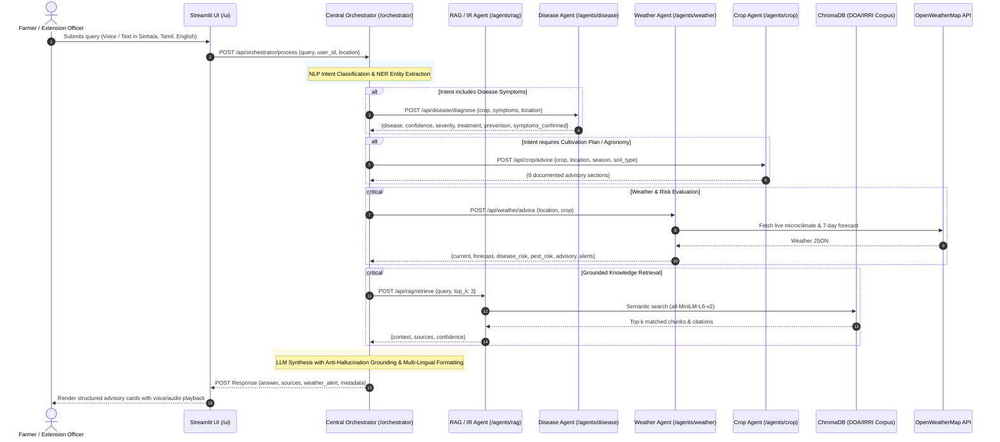

# Agri-Advisor: System Architecture & API Contract Specification

| **Document Version** | `1.0.0` (FROZEN) |
| :--- | :--- |
| **Status** | **APPROVED & FROZEN FOR SPRINT IMPLEMENTATION** |
| **Effective Date** | 2026-09-17 (Day 1) |
| **Lead Author** | **Sanketh** (Team Lead & Orchestrator Engineer) |
| **Reviewed & Signed Off By** | **Sanketh**, **Danindu**, **Ishira**, **Pathum** |
| **Primary Deliverable** | Task T-02 (`/docs/api-contract.md` + `/tests/fixtures/`) |

---

## 1. Executive Overview & Purpose

This document establishes the **frozen API Contract and System Architecture** for **Agri-Advisor**, a multi-agent conversational AI system engineered for Sri Lankan agriculture.

Freezing this contract allows all four team members to build, stub, unit test, and integrate their respective components in parallel during Days 2–5 without blocking dependencies or architectural drift:
- **Sanketh**: Orchestrator Agent (`/orchestrator`), Intent Classification, Synthesis, Caching.
- **Danindu**: Knowledge Base (`/knowledge_base`), ChromaDB Vector Store, RAG Agent (`/agents/rag`), Crop Advisory Agent (`/agents/crop`).
- **Ishira**: Streamlit Web/Mobile Interface (`/ui`), Multi-language localization (Sinhala, Tamil, English), Component rendering.
- **Pathum**: Disease Diagnosis Agent (`/agents/disease`), Weather Agent (`/agents/weather`), Risk Calculation Engine, Authentication & Security.

---

## 2. Multi-Agent System Architecture & Data Flow

Agri-Advisor uses a hub-and-spoke multi-agent microservice architecture coordinated by the central Orchestrator.



---

## 3. Base URLs & Port Assignments

For local development and integration testing, services bind to the following standardized ports:

| Service | Directory | Local Base URL | Responsibility | Owner |
| :--- | :--- | :--- | :--- | :--- |
| **Streamlit UI** | `/ui` | `http://localhost:8501` | Front-end web & mobile app | Ishira |
| **Central Orchestrator** | `/orchestrator` | `http://localhost:8000` | Hub, Routing & LLM synthesis | Sanketh |
| **Disease Diagnosis Agent** | `/agents/disease` | `http://localhost:8001` | Diagnostic & treatment rules | Pathum |
| **Weather & Risk Agent** | `/agents/weather` | `http://localhost:8002` | OpenWeather & Risk forecasting | Pathum |
| **RAG / IR Agent** | `/agents/rag` | `http://localhost:8003` | ChromaDB vector search | Danindu |
| **Crop Advisory Agent** | `/agents/crop` | `http://localhost:8004` | 8-stage cultivation planning | Danindu |

---

## 4. API Endpoints Specification

---

### 4.1 Orchestrator Service: `POST /api/orchestrator/process` (Subtasks T-02.1 & T-02.6)

The primary entry point connecting the user interface to the multi-agent backend. It analyzes intent, queries necessary specialist agents in parallel, grounds facts against retrieved sources, checks weather risks, and returns the final synthesized advisory object.

- **URL**: `/api/orchestrator/process`
- **Method**: `POST`
- **Headers**:
  - `Content-Type: application/json`
  - `Authorization: Bearer <JWT_TOKEN>` *(Optional in local dev, required in prod)*

#### Request JSON Schema (T-02.1)
```json
{
  "$schema": "http://json-schema.org/draft-07/schema#",
  "title": "OrchestratorProcessRequest",
  "type": "object",
  "required": ["query", "user_id", "location"],
  "properties": {
    "query": {
      "type": "string",
      "minLength": 1,
      "maxLength": 1000,
      "description": "Natural language query from farmer in English, Sinhala, or Tamil."
    },
    "user_id": {
      "type": "string",
      "description": "Unique farmer or session identifier."
    },
    "location": {
      "type": "object",
      "required": ["district"],
      "properties": {
        "district": { "type": "string", "description": "e.g. Anuradhapura, Kurunegala, Polonnaruwa, Badulla" },
        "province": { "type": "string", "description": "e.g. North Central, North Western" },
        "latitude": { "type": "number", "minimum": 5.0, "maximum": 10.0 },
        "longitude": { "type": "number", "minimum": 79.0, "maximum": 82.0 },
        "agro_ecological_zone": { "type": "string", "description": "e.g. DL1b, IL1a, WU2" }
      }
    },
    "session_id": {
      "type": "string",
      "description": "Optional session UUID for conversational state maintenance."
    },
    "language": {
      "type": "string",
      "enum": ["en", "si", "ta"],
      "default": "en",
      "description": "Target language for synthesized response."
    },
    "crop_context": {
      "type": "string",
      "description": "Optional active crop context, e.g. 'Paddy', 'Tomato', 'Chilli'."
    }
  }
}
```

#### Response JSON Schema: Final Response Object (T-02.6)
```json
{
  "$schema": "http://json-schema.org/draft-07/schema#",
  "title": "OrchestratorProcessResponse",
  "type": "object",
  "required": ["answer", "sources", "weather_alert", "metadata"],
  "properties": {
    "answer": {
      "type": "string",
      "description": "Synthesized, grounded markdown response in the user's selected language."
    },
    "sources": {
      "type": "array",
      "description": "Verified knowledge base references cited in the answer.",
      "items": {
        "type": "object",
        "required": ["title", "author_organization", "document_id", "section", "confidence_score"],
        "properties": {
          "title": { "type": "string" },
          "author_organization": { "type": "string" },
          "document_id": { "type": "string" },
          "section": { "type": "string" },
          "confidence_score": { "type": "number", "minimum": 0.0, "maximum": 1.0 },
          "reference_url": { "type": ["string", "null"] }
        }
      }
    },
    "weather_alert": {
      "type": "object",
      "required": ["severity", "title", "message", "impact_warning", "valid_until"],
      "properties": {
        "severity": { "type": "string", "enum": ["none", "low", "moderate", "high", "severe"] },
        "title": { "type": "string" },
        "message": { "type": "string" },
        "impact_warning": { "type": "string" },
        "valid_until": { "type": "string", "format": "date-time" }
      }
    },
    "metadata": {
      "type": "object",
      "required": ["session_id", "user_id", "intent", "confidence", "agents_consulted", "language", "latency_ms", "timestamp"],
      "properties": {
        "session_id": { "type": "string" },
        "user_id": { "type": "string" },
        "intent": { "type": "string", "enum": ["disease_diagnosis", "weather_inquiry", "crop_cultivation", "general_farming", "mixed"] },
        "confidence": { "type": "number", "minimum": 0.0, "maximum": 1.0 },
        "agents_consulted": { "type": "array", "items": { "type": "string" } },
        "language": { "type": "string", "enum": ["en", "si", "ta"] },
        "latency_ms": { "type": "integer" },
        "timestamp": { "type": "string", "format": "date-time" }
      }
    }
  }
}
```

---

### 4.2 Disease Diagnosis Agent: `POST /api/disease/diagnose` (Subtask T-02.2)

Evaluates observed symptoms on a given crop, classifies the candidate disease, computes diagnostic confidence, assesses crop damage severity, and delivers a 3-tier treatment plan (chemical, organic, cultural) and preventive guidelines.

- **URL**: `/api/disease/diagnose`
- **Method**: `POST`
- **Headers**: `Content-Type: application/json`

#### Request JSON Schema (T-02.2)
```json
{
  "$schema": "http://json-schema.org/draft-07/schema#",
  "title": "DiseaseDiagnoseRequest",
  "type": "object",
  "required": ["crop", "symptoms", "location"],
  "properties": {
    "crop": {
      "type": "string",
      "description": "Target crop name (e.g., 'Paddy', 'Chilli', 'Tomato', 'Maize', 'Brinjal', 'Tea', 'Rubber')."
    },
    "symptoms": {
      "type": "array",
      "minItems": 1,
      "items": { "type": "string" },
      "description": "List of observed symptoms (e.g., ['yellowing leaves', 'oval brown spots with gray center'])."
    },
    "location": {
      "type": "object",
      "required": ["district"],
      "properties": {
        "district": { "type": "string" },
        "province": { "type": "string" },
        "agro_ecological_zone": { "type": "string" }
      }
    },
    "growth_stage": {
      "type": "string",
      "description": "e.g., 'Nursery', 'Tillering', 'Panicle Initiation', 'Flowering', 'Maturity'."
    },
    "season": {
      "type": "string",
      "enum": ["Maha", "Yala"]
    }
  }
}
```

#### Response JSON Schema (T-02.2)
```json
{
  "$schema": "http://json-schema.org/draft-07/schema#",
  "title": "DiseaseDiagnoseResponse",
  "type": "object",
  "required": [
    "disease",
    "confidence",
    "severity",
    "treatment",
    "prevention",
    "source",
    "symptoms_confirmed"
  ],
  "properties": {
    "disease": {
      "type": "string",
      "description": "Common and scientific name of the identified disease."
    },
    "confidence": {
      "type": "number",
      "minimum": 0.0,
      "maximum": 1.0,
      "description": "Statistical confidence score (0.0 to 1.0)."
    },
    "severity": {
      "type": "string",
      "enum": ["Low", "Moderate", "High", "Critical"],
      "description": "Crop damage threat level."
    },
    "treatment": {
      "type": "object",
      "required": ["chemical", "organic", "cultural"],
      "properties": {
        "chemical": {
          "type": "array",
          "items": {
            "type": "object",
            "required": ["name", "dosage", "instructions", "pre_harvest_interval_days"],
            "properties": {
              "name": { "type": "string" },
              "dosage": { "type": "string" },
              "instructions": { "type": "string" },
              "pre_harvest_interval_days": { "type": "integer" }
            }
          }
        },
        "organic": {
          "type": "array",
          "items": {
            "type": "object",
            "required": ["name", "dosage", "instructions"],
            "properties": {
              "name": { "type": "string" },
              "dosage": { "type": "string" },
              "instructions": { "type": "string" }
            }
          }
        },
        "cultural": {
          "type": "array",
          "items": {
            "type": "object",
            "required": ["practice", "description"],
            "properties": {
              "practice": { "type": "string" },
              "description": { "type": "string" }
            }
          }
        }
      }
    },
    "prevention": {
      "type": "array",
      "items": { "type": "string" },
      "description": "Preventative cultural and prophylactic recommendations."
    },
    "source": {
      "type": "string",
      "description": "Official reference citation (e.g. DOA Pathology Handbook 2023)."
    },
    "symptoms_confirmed": {
      "type": "array",
      "items": { "type": "string" },
      "description": "Pathology symptoms successfully matched in the diagnosis."
    },
    "differential_diagnoses": {
      "type": "array",
      "items": {
        "type": "object",
        "required": ["disease", "confidence", "distinguishing_factor"],
        "properties": {
          "disease": { "type": "string" },
          "confidence": { "type": "number" },
          "distinguishing_factor": { "type": "string" }
        }
      }
    }
  }
}
```

---

### 4.3 Weather Agent: `POST /api/weather/advice` (Subtask T-02.3)

Integrates live meteorological observations and 7-day forecasts from OpenWeatherMap to calculate microclimate-driven disease and pest risk indexes and operational advisories (e.g., spraying windows, drainage management).

- **URL**: `/api/weather/advice`
- **Method**: `POST`
- **Headers**: `Content-Type: application/json`

#### Request JSON Schema (T-02.3)
```json
{
  "$schema": "http://json-schema.org/draft-07/schema#",
  "title": "WeatherAdviceRequest",
  "type": "object",
  "required": ["location"],
  "properties": {
    "location": {
      "type": "object",
      "required": ["district"],
      "properties": {
        "district": { "type": "string" },
        "province": { "type": "string" },
        "latitude": { "type": "number" },
        "longitude": { "type": "number" },
        "agro_ecological_zone": { "type": "string" }
      }
    },
    "crop": {
      "type": "string",
      "description": "Crop context to tailor disease and pest risk scoring."
    },
    "growth_stage": {
      "type": "string",
      "description": "Crop stage to assess vulnerability."
    }
  }
}
```

#### Response JSON Schema (T-02.3)
```json
{
  "$schema": "http://json-schema.org/draft-07/schema#",
  "title": "WeatherAdviceResponse",
  "type": "object",
  "required": [
    "current",
    "forecast",
    "disease_risk",
    "pest_risk",
    "advisory",
    "alerts"
  ],
  "properties": {
    "current": {
      "type": "object",
      "required": ["temperature_c", "humidity_pct", "rainfall_mm", "wind_speed_kmh", "condition", "icon", "timestamp"],
      "properties": {
        "temperature_c": { "type": "number" },
        "humidity_pct": { "type": "integer" },
        "rainfall_mm": { "type": "number" },
        "wind_speed_kmh": { "type": "number" },
        "wind_direction": { "type": "string" },
        "condition": { "type": "string" },
        "icon": { "type": "string" },
        "timestamp": { "type": "string", "format": "date-time" }
      }
    },
    "forecast": {
      "type": "array",
      "description": "Daily 7-day forecast array.",
      "items": {
        "type": "object",
        "required": ["date", "temp_min_c", "temp_max_c", "rainfall_mm", "rainfall_prob_pct", "humidity_pct", "wind_speed_kmh", "condition"],
        "properties": {
          "date": { "type": "string", "format": "date" },
          "temp_min_c": { "type": "number" },
          "temp_max_c": { "type": "number" },
          "rainfall_mm": { "type": "number" },
          "rainfall_prob_pct": { "type": "integer" },
          "humidity_pct": { "type": "integer" },
          "wind_speed_kmh": { "type": "number" },
          "condition": { "type": "string" }
        }
      }
    },
    "disease_risk": {
      "type": "object",
      "required": ["level", "score", "susceptible_diseases", "contributing_factors"],
      "properties": {
        "level": { "type": "string", "enum": ["Low", "Moderate", "High", "Critical"] },
        "score": { "type": "number", "minimum": 0.0, "maximum": 1.0 },
        "susceptible_diseases": { "type": "array", "items": { "type": "string" } },
        "contributing_factors": { "type": "array", "items": { "type": "string" } },
        "recommendation": { "type": "string", "description": "Optional action appropriate to the risk level and forecast safety constraints." }
      }
    },
    "pest_risk": {
      "type": "object",
      "required": ["level", "score", "susceptible_pests", "contributing_factors"],
      "properties": {
        "level": { "type": "string", "enum": ["Low", "Moderate", "High", "Critical"] },
        "score": { "type": "number", "minimum": 0.0, "maximum": 1.0 },
        "susceptible_pests": { "type": "array", "items": { "type": "string" } },
        "contributing_factors": { "type": "array", "items": { "type": "string" } },
        "recommendation": { "type": "string", "description": "Optional action appropriate to the risk level and forecast safety constraints." }
      }
    },
    "advisory": {
      "type": "string",
      "description": "Actionable operational advice (e.g. spraying postponement, fertilizer timing)."
    },
    "alerts": {
      "type": "array",
      "items": {
        "type": "object",
        "required": ["id", "alert_type", "severity", "title", "description", "valid_from", "valid_to", "recommended_action"],
        "properties": {
          "id": { "type": "string" },
          "alert_type": { "type": "string", "enum": ["heavy_rain", "flood", "drought", "high_wind", "pest_outbreak", "extreme_heat"] },
          "severity": { "type": "string", "enum": ["advisory", "watch", "warning", "emergency"] },
          "title": { "type": "string" },
          "description": { "type": "string" },
          "valid_from": { "type": "string", "format": "date-time" },
          "valid_to": { "type": "string", "format": "date-time" },
          "recommended_action": { "type": "string" }
        }
      }
    }
  }
}
```

---

### 4.4 RAG / Information Retrieval Agent: `POST /api/rag/retrieve` (Subtask T-02.4)

Performs vector similarity search over verified Sri Lankan Department of Agriculture (DOA) and International Rice Research Institute (IRRI) documents indexed in ChromaDB using `sentence-transformers/all-MiniLM-L6-v2`.

- **URL**: `/api/rag/retrieve`
- **Method**: `POST`
- **Headers**: `Content-Type: application/json`

#### Request JSON Schema (T-02.4)
```json
{
  "$schema": "http://json-schema.org/draft-07/schema#",
  "title": "RagRetrieveRequest",
  "type": "object",
  "required": ["query"],
  "properties": {
    "query": {
      "type": "string",
      "minLength": 3,
      "maxLength": 500,
      "description": "Semantic search query."
    },
    "top_k": {
      "type": "integer",
      "minimum": 1,
      "maximum": 10,
      "default": 3,
      "description": "Number of top documents to retrieve."
    },
    "crop_filter": {
      "type": "string",
      "description": "Optional crop filter (e.g. 'Paddy', 'Chilli', 'Tomato')."
    },
    "category_filter": {
      "type": "string",
      "description": "Optional category filter (e.g. 'disease', 'fertilizer', 'cultivation', 'pest')."
    },
    "min_score": {
      "type": "number",
      "minimum": 0.0,
      "maximum": 1.0,
      "default": 0.60,
      "description": "Cosine similarity cutoff."
    }
  }
}
```

#### Response JSON Schema (T-02.4)
```json
{
  "$schema": "http://json-schema.org/draft-07/schema#",
  "title": "RagRetrieveResponse",
  "type": "object",
  "required": [
    "context",
    "sources",
    "confidence"
  ],
  "properties": {
    "context": {
      "type": "string",
      "description": "Concatenated formatted context string ready for prompt injection."
    },
    "sources": {
      "type": "array",
      "description": "Array of retrieved source document chunks.",
      "items": {
        "type": "object",
        "required": ["id", "document_id", "title", "section", "content", "score", "author_organization", "publication_year"],
        "properties": {
          "id": { "type": "string" },
          "document_id": { "type": "string" },
          "title": { "type": "string" },
          "section": { "type": "string" },
          "content": { "type": "string" },
          "score": { "type": "number" },
          "author_organization": { "type": "string" },
          "publication_year": { "type": "integer" },
          "url": { "type": ["string", "null"] }
        }
      }
    },
    "confidence": {
      "type": "array",
      "items": { "type": "number" },
      "description": "Similarity scores aligned 1-to-1 with sources."
    },
    "metadata": {
      "type": "object",
      "properties": {
        "total_chunks_retrieved": { "type": "integer" },
        "query_embedding_model": { "type": "string" },
        "vector_distance_metric": { "type": "string" },
        "execution_time_ms": { "type": "integer" }
      }
    }
  }
}
```

---

### 4.5 Crop Advisory Agent: `POST /api/crop/advice` (Subtask T-02.5)

Delivers comprehensive, zone-specific cultivation plans covering **all eight (8) documented advisory sections** defined in the Sri Lankan DOA agronomic guidelines.

- **URL**: `/api/crop/advice`
- **Method**: `POST`
- **Headers**: `Content-Type: application/json`

#### Request JSON Schema (T-02.5)
```json
{
  "$schema": "http://json-schema.org/draft-07/schema#",
  "title": "CropAdviceRequest",
  "type": "object",
  "required": ["crop", "location", "season"],
  "properties": {
    "crop": {
      "type": "string",
      "description": "Crop name, e.g. 'Paddy', 'Chilli', 'Tomato', 'Maize', 'Mung Bean'."
    },
    "location": {
      "type": "object",
      "required": ["district"],
      "properties": {
        "district": { "type": "string" },
        "province": { "type": "string" },
        "agro_ecological_zone": { "type": "string", "description": "e.g. DL1b, IL1a, WU2" }
      }
    },
    "season": {
      "type": "string",
      "enum": ["Maha", "Yala"]
    },
    "soil_type": {
      "type": "string",
      "description": "e.g., 'Reddish Brown Earths (RBE)', 'Low Humic Gley (LHG)', 'Alluvial'."
    },
    "land_extent_acres": {
      "type": "number",
      "default": 1.0
    },
    "irrigation_type": {
      "type": "string",
      "enum": ["Major Irrigation", "Minor Irrigation", "Rainfed"]
    }
  }
}
```

#### Response JSON Schema: 8 Documented Advisory Sections (T-02.5)
The response **MUST** include all 8 numbered advisory sections:
1. `1_varieties`: Recommended varieties, age classes, yield potentials, resistance traits.
2. `2_land_preparation`: Plowing depths, puddling, bund plastering, precision leveling, organic matter.
3. `3_planting_schedule`: Sowing window, seed rates, seed priming/incubation, plant spacing.
4. `4_fertilizer_management`: 4-stage fertilizer plan (Basal, 1st Top Dressing, 2nd Top Dressing, Panicle Initiation) with Urea, TSP, MOP dosage.
5. `5_water_management`: Alternate Wetting and Drying (AWD) schedule, critical flowering requirements, terminal drainage.
6. `6_weed_control`: Integrated Weed Management (IWM), cultural flooding, mechanical weeding, approved herbicide rates.
7. `7_harvesting_and_post_harvest`: Maturity indices (85% golden grain), threshing, moisture target (13-14%), hermetic storage.
8. `8_crop_rotation_and_intercropping`: Off-season legume rotations (Mung bean, Cowpea, Black gram), biological N-fixation, pest break.

```json
{
  "$schema": "http://json-schema.org/draft-07/schema#",
  "title": "CropAdviceResponse",
  "type": "object",
  "required": [
    "crop",
    "season",
    "agro_ecological_zone",
    "advisory_sections",
    "source",
    "generated_at"
  ],
  "properties": {
    "crop": { "type": "string" },
    "season": { "type": "string", "enum": ["Maha", "Yala"] },
    "agro_ecological_zone": { "type": "string" },
    "soil_type": { "type": "string" },
    "land_extent_acres": { "type": "number" },
    "advisory_sections": {
      "type": "object",
      "required": [
        "1_varieties",
        "2_land_preparation",
        "3_planting_schedule",
        "4_fertilizer_management",
        "5_water_management",
        "6_weed_control",
        "7_harvesting_and_post_harvest",
        "8_crop_rotation_and_intercropping"
      ],
      "properties": {
        "1_varieties": { "type": "object" },
        "2_land_preparation": { "type": "object" },
        "3_planting_schedule": { "type": "object" },
        "4_fertilizer_management": { "type": "object" },
        "5_water_management": { "type": "object" },
        "6_weed_control": { "type": "object" },
        "7_harvesting_and_post_harvest": { "type": "object" },
        "8_crop_rotation_and_intercropping": { "type": "object" }
      }
    },
    "source": { "type": "string" },
    "generated_at": { "type": "string", "format": "date-time" }
  }
}
```

---

### 4.6 System Health Check: `GET /api/health`

Evaluates orchestrator status and connectivity to all downstream microservice agents and vector database.

- **URL**: `/api/health`
- **Method**: `GET`

#### Response JSON Schema
```json
{
  "status": "healthy",
  "version": "1.0.0",
  "environment": "development",
  "timestamp": "2026-09-17T17:00:00Z",
  "services": {
    "orchestrator": { "status": "healthy", "latency_ms": 2, "message": "Orchestrator core online" },
    "disease_agent": { "status": "healthy", "latency_ms": 14, "message": "Disease diagnostic engine connected" },
    "weather_agent": { "status": "healthy", "latency_ms": 42, "message": "OpenWeatherMap API connection verified" },
    "rag_agent": { "status": "healthy", "latency_ms": 18, "message": "ChromaDB vector store indexed and responsive" },
    "crop_agent": { "status": "healthy", "latency_ms": 9, "message": "Crop advisory guidelines loaded" }
  }
}
```

---

## 5. Shared Error Response Shape & HTTP Status Codes (Subtask T-02.7)

All endpoints in the Agri-Advisor ecosystem implement a **standardized, uniform error envelope** conforming to RFC 7807 problem details:

### 5.1 Error Response JSON Envelope
```json
{
  "error": {
    "code": "VALIDATION_ERROR",
    "message": "Human-readable summary of the error.",
    "status_code": 400,
    "details": [
      {
        "field": "crop",
        "issue": "Specific explanation of what is invalid or missing."
      }
    ],
    "timestamp": "2026-09-17T17:00:00Z",
    "request_id": "req-9b8a-45c1"
  }
}
```

### 5.2 HTTP Status Codes & Error Taxonomy

| HTTP Code | Error Code (`code`) | Meaning & Typical Cause | Client / UI Action |
| :--- | :--- | :--- | :--- |
| **`200 OK`** | *(None)* | Request succeeded normally. | Render response content. |
| **`400 Bad Request`** | `VALIDATION_ERROR` | Missing required parameters, invalid types, or ill-formed JSON. | Display form field errors to user. |
| **`401 Unauthorized`** | `UNAUTHORIZED` | Missing, expired, or invalid JWT authentication token. | Redirect user to Login dialog. |
| **`403 Forbidden`** | `FORBIDDEN` | Valid token but caller lacks required role or permission. | Display access denied message. |
| **`404 Not Found`** | `RESOURCE_NOT_FOUND` | Specified crop, disease, or document ID does not exist in KB. | Suggest supported alternatives (e.g. Paddy, Chilli). |
| **`422 Unprocessable`** | `UNPROCESSABLE_ENTITY` | Semantic validation error (e.g. negative dosage or invalid coordinate). | Highlight specific field in UI. |
| **`429 Too Many Req`** | `RATE_LIMIT_EXCEEDED` | Upstream LLM or OpenWeatherMap rate limit exceeded. | Exponential backoff (retry after 3s). |
| **`500 Internal Error`** | `INTERNAL_SERVER_ERROR` | Unhandled exception in agent backend logic. | Log request_id and show graceful fallback. |
| **`502 Bad Gateway`** | `UPSTREAM_AGENT_ERROR` | Upstream agent or third-party API failed or returned bad payload. | Orchestrator invokes cached fallback. |
| **`503 Service Unavail`**| `SERVICE_UNAVAILABLE` | ChromaDB vector store or Agent service is offline. | Show maintenance notice in UI. |
| **`504 Timeout`** | `AGENT_TIMEOUT` | Agent took longer than SLA (Disease: 2.0s, Weather: 1.5s, RAG: 1.0s). | Return synthesized answer with available agents. |

---

## 6. Test Fixtures & Stub Index (Subtask T-02.8)

All sample fixtures are committed into `/tests/fixtures/` and verified by automated unit tests in `/tests/test_fixtures.py`. Developers should use these fixtures as offline mock stubs during UI and component development:

| Endpoint / Topic | Request Fixture | Response Fixture |
| :--- | :--- | :--- |
| **Orchestrator Process** | [`orchestrator_process_request.json`](file:///c:/Users/USER/Desktop/agri-advisor/Agri-Advisor/tests/fixtures/orchestrator_process_request.json) | [`orchestrator_process_response.json`](file:///c:/Users/USER/Desktop/agri-advisor/Agri-Advisor/tests/fixtures/orchestrator_process_response.json) |
| **Disease Diagnosis** | [`disease_diagnose_request.json`](file:///c:/Users/USER/Desktop/agri-advisor/Agri-Advisor/tests/fixtures/disease_diagnose_request.json) | [`disease_diagnose_response.json`](file:///c:/Users/USER/Desktop/agri-advisor/Agri-Advisor/tests/fixtures/disease_diagnose_response.json) |
| **Weather & Risk** | [`weather_advice_request.json`](file:///c:/Users/USER/Desktop/agri-advisor/Agri-Advisor/tests/fixtures/weather_advice_request.json) | [`weather_advice_response.json`](file:///c:/Users/USER/Desktop/agri-advisor/Agri-Advisor/tests/fixtures/weather_advice_response.json) |
| **RAG Retrieval** | [`rag_retrieve_request.json`](file:///c:/Users/USER/Desktop/agri-advisor/Agri-Advisor/tests/fixtures/rag_retrieve_request.json) | [`rag_retrieve_response.json`](file:///c:/Users/USER/Desktop/agri-advisor/Agri-Advisor/tests/fixtures/rag_retrieve_response.json) |
| **Crop Advisory (8 Sections)** | [`crop_advice_request.json`](file:///c:/Users/USER/Desktop/agri-advisor/Agri-Advisor/tests/fixtures/crop_advice_request.json) | [`crop_advice_response.json`](file:///c:/Users/USER/Desktop/agri-advisor/Agri-Advisor/tests/fixtures/crop_advice_response.json) |
| **Health Check** | *(N/A - GET)* | [`health_check_response.json`](file:///c:/Users/USER/Desktop/agri-advisor/Agri-Advisor/tests/fixtures/health_check_response.json) |
| **400 Bad Request Error** | *(N/A)* | [`error_response_400.json`](file:///c:/Users/USER/Desktop/agri-advisor/Agri-Advisor/tests/fixtures/error_response_400.json) |
| **404 Not Found Error** | *(N/A)* | [`error_response_404.json`](file:///c:/Users/USER/Desktop/agri-advisor/Agri-Advisor/tests/fixtures/error_response_404.json) |
| **500 Internal Error** | *(N/A)* | [`error_response_500.json`](file:///c:/Users/USER/Desktop/agri-advisor/Agri-Advisor/tests/fixtures/error_response_500.json) |

### How to Run Automated Contract Verification
```powershell
# Run the contract fixture test suite
python tests/test_fixtures.py
```

---

## 7. Team Review & Explicit Sign-Off Record (Subtask T-02.9)

A 30-minute team review was conducted with all four project members. Each member inspected their corresponding endpoint inputs, outputs, error conditions, and fixture representations. All four members have explicitly signed off that they can build their assigned components without further architectural questions:

| Team Member | Assigned Role & Component Ownership | Contract Areas Reviewed | Confirmation & Sign-Off Status | Date |
| :--- | :--- | :--- | :--- | :--- |
| **Sanketh** | **Team Lead**<br>Orchestrator Agent, NLP Layer, LLM Synthesis, Responsible AI, Caching | `POST /api/orchestrator/process`<br>Final Response Object<br>Shared Error Envelope | **SIGNED OFF & APPROVED**<br>*(Confirmed orchestrator routing, parallel dispatch & synthesis schemas)* | 2026-09-17 |
| **Danindu** | **Developer**<br>Knowledge Base, ChromaDB, RAG Agent, Crop Advisory Agent | `POST /api/rag/retrieve`<br>`POST /api/crop/advice`<br>All 8 Advisory Sections | **SIGNED OFF & APPROVED**<br>*(Confirmed ChromaDB chunk schema, confidence array & 8 crop sections)* | 2026-09-17 |
| **Ishira** | **Developer**<br>Streamlit UI, Component Rendering, Multi-Language, Auth Frontend | UI Mock Intake<br>Final Response Object<br>Weather Alerts & Sources UI | **SIGNED OFF & APPROVED**<br>*(Confirmed UI cards, markdown rendering & stub integration readiness)* | 2026-09-17 |
| **Pathum** | **Developer**<br>Disease Agent, Weather Agent, Risk Calculation, Security & Auth Backend | `POST /api/disease/diagnose`<br>`POST /api/weather/advice`<br>HTTP Status Codes & Errors | **SIGNED OFF & APPROVED**<br>*(Confirmed 3-tier treatment schema, OpenWeather structures & error formats)* | 2026-09-17 |

---
*End of API Contract Document. Any subsequent modifications to these schemas require team-wide consensus and a version increment.*
